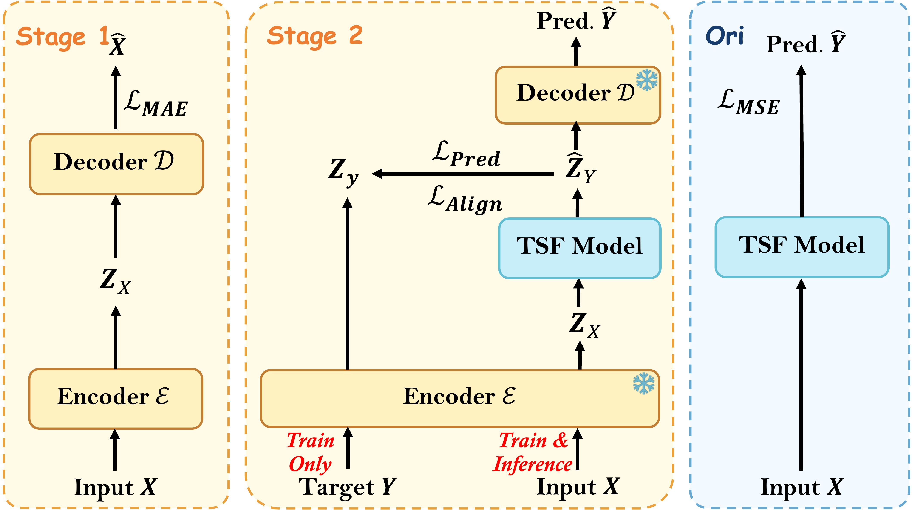

# LatentTSF: From Observations to States: Latent Time Series Forecasting (ICML 2026)

<p align="center">
<a href="https://arxiv.org/abs/2602.00297"></a>
<a href="https://icml.cc/"></a>
<a href="LICENSE"></a>
</p>

Official PyTorch implementation of **[*From Observations to States: Latent Time Series Forecasting*](https://arxiv.org/abs/2602.00297)** (ICML 2026).

**Authors:** Jie Yang, Yifan Hu, Yuante Li, Kexin Zhang, Kaize Ding, Philip S. Yu

> **TL;DR.** Standard time-series forecasters predict raw observations, but their hidden representations exhibit *Latent Chaos* — temporally disordered states that hurt long-horizon stability. **LatentTSF** instead trains the forecaster to predict the *latent states* of a frozen pretrained autoencoder, using a latent-space loss plus an auxiliary perceptual decoding loss. The objective implicitly maximizes the mutual information between predicted and ground-truth latent states.

<p align="center">

</p>

## Overview

A pretrained autoencoder $(\mathcal{E}, \mathcal{D})$ is frozen, and a forecaster $f_\theta$ is trained entirely in its latent space:

$$
X \xrightarrow{\mathcal{E}} Z_X \xrightarrow{f_\theta} \hat{Z} \xrightarrow{\mathcal{D}} \hat{Y}, \qquad Y \xrightarrow{\mathcal{E}} Z_Y
$$

The objective combines a latent-space loss and an auxiliary perceptual loss:

$$
\mathcal{L}_{\text{latent}} \;=\; \mathrm{MSE}(\hat{Z}, Z_Y) \;+\; \beta \cdot \bigl(1 - \cos(\hat{Z}, Z_Y)\bigr)
$$

$$
\mathcal{L}_{\text{perc}} \;=\; \mathrm{MSE}\bigl(\mathcal{D}(\hat{Z}),\, Y\bigr)
$$

$$
\mathcal{L}_{\text{total}} \;=\; \mathcal{L}_{\text{latent}} \;+\; \alpha \cdot \mathcal{L}_{\text{perc}}
$$

Only $f_\theta$ is updated during training. The perceptual term keeps the decoded forecast on the data manifold.

## Requirements

- Python ≥3.8
- PyTorch (install separately to match your CUDA version, e.g. `pip install torch --index-url https://download.pytorch.org/whl/cu121` — see https://pytorch.org/get-started/locally/)
- All other dependencies: `pip install -r requirements.txt`

`requirements.txt` mirrors the upstream [Time-Series-Library](https://github.com/thuml/Time-Series-Library/blob/main/requirements.txt) list (so all baseline models in `models/` can be loaded), plus `wandb` for experiment logging. `torch` is intentionally not pinned.

## Setup

Download the benchmark datasets to `./dataset/` (created on first run):

```bash
python download_datasets.py
```

This pulls ETTh1/2, ETTm1/2, weather, electricity, traffic, exchange_rate, and solar_energy from HuggingFace into `./dataset/`. Users in mainland China can speed it up by exporting a mirror endpoint **before** running:

```bash
export HF_ENDPOINT=https://hf-mirror.com
python download_datasets.py
```

## Quick Start

### 1. Reproduce with the pretrained AE

The repository ships with 9 pretrained autoencoders (one per benchmark). To train a latent-space forecaster on top of them:

```bash
bash run_train.sh
```

By default this runs DLinear in latent mode on ETTh1, loading `checkpoints/AutoEncoder_MLP_MAE_ETTh1_..._sl24_..._0/checkpoint.pth`. Edit `run_train.sh` to switch dataset / model / forecast horizon — the matching AE checkpoint path can be looked up in the [Pretrained AE Checkpoints](#pretrained-ae-checkpoints) table.

### 2. Original (baseline) mode — no autoencoder

Drop `--use_latent` and the AE arguments to train any model directly on the raw signal (this is the standard TSLib training path). See `my_train.py --help` for the full argument list, or the inline comments in `run_train.sh`.

### 3. Train your own autoencoder

If you want to retrain the AE from scratch (e.g. a different `seq_len` or `d_model`):

```bash
bash run_ae.sh
```

The default settings reproduce the ETTh1 row of the checkpoint table (`sl=24, dm=32, dff=64, lr=5e-4, bs=32, ep=500`). For other datasets, copy the values from the table.

## Pretrained AE Checkpoints

The `./checkpoints/` directory ships with the 9 pretrained MLP autoencoders used in the paper. All AEs are trained with `seq_len=24`, `ae_type=MLP`, `ae_loss=MAE`, `lradj=0`.

| Dataset       | enc_in | d_model | d_ff | AE training config       | Checkpoint folder                                                                                         |
| ------------- | ------ | ------- | ---- | ------------------------ | --------------------------------------------------------------------------------------------------------- |
| ETTh1         | 7      | 32      | 64   | lr=0.0005, bs=32, ep=500 | `AutoEncoder_MLP_MAE_ETTh1_AE_ETTh1_ftM_sl24_dm32_dff64_lradj0_Exp-sl24-lr0.0005-500-32bs_0`            |
| ETTh2         | 7      | 64      | 128  | lr=0.0005, bs=32, ep=500 | `AutoEncoder_MLP_MAE_ETTh2_AE_ETTh2_ftM_sl24_dm64_dff128_lradj0_Exp-sl24-lr0.0005-500-32bs_0`           |
| ETTm1         | 7      | 32      | 64   | lr=0.0005, bs=32, ep=500 | `AutoEncoder_MLP_MAE_ETTm1_AE_ETTm1_ftM_sl24_dm32_dff64_lradj0_Exp-sl24-lr0.0005-500-32bs_0`            |
| ETTm2         | 7      | 64      | 128  | lr=0.0005, bs=32, ep=500 | `AutoEncoder_MLP_MAE_ETTm2_AE_ETTm2_ftM_sl24_dm64_dff128_lradj0_Exp-sl24-lr0.0005-500-32bs_0`           |
| exchange_rate | 8      | 128     | 256  | lr=0.0005, bs=32, ep=500 | `AutoEncoder_MLP_MAE_exchange_rate_AE_custom_ftM_sl24_dm128_dff256_lradj0_Exp-sl24-lr0.0005-500-32bs_0` |
| weather       | 21     | 64      | 128  | lr=0.0005, bs=32, ep=500 | `AutoEncoder_MLP_MAE_weather_AE_custom_ftM_sl24_dm64_dff128_lradj0_Exp-sl24-lr0.0005-500-32bs_0`        |
| electricity   | 321    | 512     | 1024 | lr=0.0001, bs=16, ep=500 | `AutoEncoder_MLP_MAE_electricity_AE_custom_ftM_sl24_dm512_dff1024_lradj0_Exp-lr0.0001-500-16bs_0`       |
| traffic       | 862    | 512     | 1024 | lr=0.0001, bs=16, ep=500 | `AutoEncoder_MLP_MAE_traffic_AE_custom_ftM_sl24_dm512_dff1024_lradj0_Exp-lr0.0001-500-16bs_0`           |
| Solar         | 137    | 256     | 512  | lr=0.0005, bs=32, ep=500 | `AutoEncoder_MLP_MAE_Solar_AE_Solar_ftM_sl24_dm256_dff512_lradj0_Exp-sl24-lr0.0005-500-32bs_0`          |

Pass the corresponding folder's `checkpoint.pth` as `--autoencoder_path` when running `my_train.py` with `--use_latent`. To retrain an AE from scratch, see `run_ae.sh` (defaults match the ETTh1 config above).

## Repository Structure

```
LatentTSF/
├── my_train.py             # Latent-space forecaster training (main entry)
├── my_AE.py                # MLP / CNN AE + training
├── my_temporal_AE.py       # Temporal AE (seq_len dimension)
├── my_MAE.py               # Masked autoencoder (optional encoder type)
├── my_utils.py             # Args, valid/test loops, CSV logging
├── RevIN.py                # RevIN normalization
├── run_train.sh            # Reproduce: latent forecaster on ETTh1
├── run_ae.sh               # Train AE from scratch (defaults = ETTh1 paper config)
├── run.py                  # Standard TSLib entry point (baselines, etc.)
├── download_datasets.py    # Fetch benchmarks from HuggingFace
├── checkpoints/            # 9 pretrained AEs (see table above)
├── data_provider/          # Dataset loaders
├── exp/                    # TSLib experiment scaffolding
├── layers/                 # Reusable layers
├── models/                 # Forecasting backbones (DLinear, iTransformer, ...)
└── utils/                  # Metrics, early stopping, DTW, etc.
```

### Notes on optional flags

- For latent mode, set `--label_len 0`.
- Pass `--result_csv results.csv` to log MSE/MAE per run.
- `ae_type` accepts `MLP`, `MLP_REVIN`, `CNN`, `Temporal`, `TemporalCNN`.
- `encoder_type=MAE` (Masked Autoencoder) is supported in code but **not used in the paper** — the 9 shipped checkpoints are all standard `MLP` autoencoders.

## Citation

If you find this work useful, please cite:

```bibtex
@inproceedings{yang2026latenttsf,
  title     = {From Observations to States: Latent Time Series Forecasting},
  author    = {Yang, Jie and Hu, Yifan and Li, Yuante and Zhang, Kexin and Ding, Kaize and Yu, Philip S.},
  booktitle = {Proceedings of the 43rd International Conference on Machine Learning (ICML)},
  year      = {2026}
}
```

For the arXiv preprint:

```bibtex
@article{yang2026observations,
  title={From Observations to States: Latent Time Series Forecasting},
  author={Yang, Jie and Hu, Yifan and Li, Yuante and Zhang, Kexin and Ding, Kaize and Yu, Philip S},
  journal={arXiv preprint arXiv:2602.00297},
  year={2026}
}
```

## Acknowledgments

This codebase builds on [Time-Series-Library](https://github.com/thuml/Time-Series-Library) (THUML). We thank the authors for their open implementation of standard forecasting baselines and benchmark loaders.

## License

This project is released under the [MIT License](LICENSE).

This repository also incorporates code from [Time-Series-Library](https://github.com/thuml/Time-Series-Library) and [N-BEATS](https://github.com/ElementAI/N-BEATS). See [NOTICE.md](NOTICE.md) for full attribution. **Note:** `utils/losses.py`, `utils/m4_summary.py`, and `data_provider/m4.py` are licensed under **CC BY-NC 4.0 (non-commercial only)** by Element AI Inc., and are NOT covered by the MIT license — replace or remove them if you need to use this codebase commercially.
